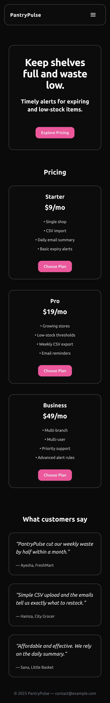

# PantryPulse — Inventory Alerts SaaS Marketing Site

A clean, accessible, responsive marketing site for PantryPulse — a simple tool that helps shops keep shelves full and waste low with timely expiry and low-stock alerts.

## Live Demo
- Deploy link: (add your Vercel URL here after deployment)

## Preview (Screenshots)
Desktop (Home)  


Mobile (Home)  


Mobile (Contact)  


## Overview
- Purpose: Present PantryPulse, capture interest, and route users to Pricing/Contact.
- Pages: Home, Features, Pricing, FAQ, Contact.
- Accessibility: Semantic landmarks, skip-to-content link, visible focus, keyboard-friendly mobile menu.

## Features
- Centered header with responsive mobile hamburger menu
- Clear hero copy and CTA
- Pricing tiers and plan comparison table
- Features section + How it works
- FAQ accordion (`<details>` / `<summary>`)
- Contact page (details + visual form)
- Open Graph image for rich link previews (`public/og.png`)

## Tech Stack
- Next.js 14 (App Router)
- React 18
- TypeScript
- Tailwind CSS

## Getting Started (Locally)
```bash
# 1) Clone
git clone <YOUR_GITHUB_REPO_URL>.git
cd pantrypulse-site

# 2) Install
npm install

# 3) Run dev server
npm run dev
# open http://localhost:3000
